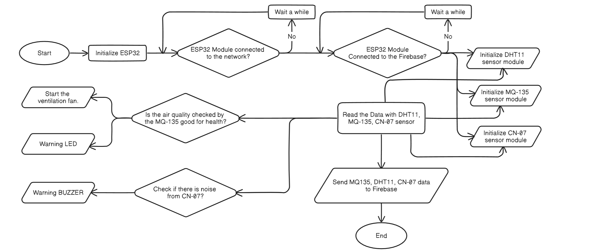
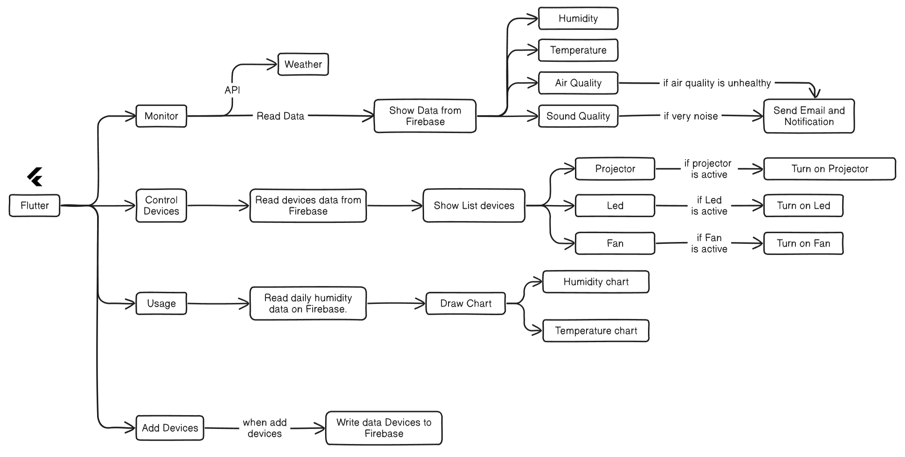

# Smart School Application System

## Description

The Smart School Application System is a project utilizing IoT architecture and platform to develop a simulated application supporting the management of school environments. This application uses sensors to measure air quality and sound environment in schools, and sends alerts when necessary.

The project aims to develop a smart school environment management application with low deployment costs and wide applicability. The application provides functions to support real-time management and device control in classrooms and school premises, collecting environmental parameters such as temperature, humidity, air quality, and noise. It has the capability for automation based on sensor data or user-programmed schedules.

The application also features statistical capabilities to enhance performance and management in a smart school environment.

## Table of Contents
1. [System Diagram](#system-diagram)
2. [ESP32 Algorithm Diagram](#esp32-algorithm-diagram)
3. [Functional Diagram of Smart School IoT Application](#functional-diagram-of-smart-school-iot-application)
4. [App Design and Development](#app-design-and-development)

## System Diagram

- The Smart School system utilizes environmental sensors to gather data such as temperature, humidity, air quality, and sound levels. These sensors send data to an ESP32 module, acting as an intermediary processor, which then transmits the data to Firebase Cloud.

- This process ensures that all environmental information is securely stored and easily accessible for analysis and management of smart classroom systems.

- The Smart School App, developed on Flutter, serves as the key interface for users to monitor and manage Firebase data effortlessly. Users can monitor real-time environmental metrics and remotely control devices like lights and fans in classrooms.

- By updating sensor data continuously on Firebase, the app provides users with comprehensive insights into classroom conditions and enables efficient remote device management. The ESP32 module reads data from Firebase and executes control commands, ensuring optimal learning environments.

## ESP32 Algorithm Diagram

[My Arduino Code](https://github.com/Tranvir0910/smart-school-esp32.git)

1. **Initialization and Network Connection:**
   - ESP32 starts up and initializes.
   - It attempts to connect to the network.
   - If connection fails, the system waits for a period before retrying. This process repeats until a successful network connection is established.

2. **Firebase Connection:**
   - Once connected to the network, ESP32 checks for connection to Firebase.
   - If Firebase connection fails, the system waits and retries until successful.

3. **Sensor Initialization:**
   - After successful network and Firebase connections, the system initializes necessary sensors:
     - DHT11 temperature and humidity sensor
     - MQ-135 air quality sensor
     - CN-07 sound sensor

4. **Data Reading and Environmental Monitoring:**
   - ESP32 starts reading data from these sensors.
   - If MQ-135 detects poor air quality harmful to health, the system activates ventilation fans to improve air quality and triggers LED lights to alert users.
   - CN-07 monitors noise levels in classrooms. If noise exceeds allowable thresholds, the system activates alarm bells to alert users, ensuring a quiet learning environment.

5. **Data Storage and Remote Management:**
   - All sensor data collected by ESP32 is sent to Firebase for storage and analysis.
   - Sending data to Firebase ensures secure data storage and enables remote access and management via the Flutter mobile app.
   - This capability allows administrators to monitor and control devices in smart classrooms efficiently, ensuring an effective, safe, and comfortable learning environment.

## Functional Diagram of Smart School IoT Application

The Smart School App provides essential functionalities for managing and monitoring environmental factors in smart classrooms:

1. **Data Monitoring and Visualization**

- Collects and monitors data from sensors for temperature, humidity, air quality, and sound.

- Data is stored and managed on Firebase, displayed in the app interface for easy monitoring by administrators.

2. **Automated Alerts and Control**

- Evaluates sensor data to detect issues such as unsafe air quality (MQ-135 sensor) or excessive noise (CN-07 sensor).

- Sends push notifications for prompt action and can activate alerts or control devices like projectors, LED lights, and fans via Firebase and ESP32 module.

3. **Historical Data Analysis**

- Displays historical data charts for temperature and humidity, aiding in trend analysis and adjustment of classroom environments.

4. **Device Management**

- Supports adding and managing new devices seamlessly via the app.

- Device information is synchronized and managed on Firebase, ensuring efficient and synchronized operations.

These features enable the Smart School App to create a smart, safe, and efficient learning environment. It not only monitors and controls classroom conditions but also supports administrators in data analysis and decision-making, thereby enhancing the educational quality and learning experience for students.

## App Design and Development

**Smart School App Main Interface**

The main interface of the Smart School App consists of four main pages, each responsible for essential functions in managing and controlling the smart classroom system.

1. **Monitor Page**
   
The first page is the "Monitor" page where the app collects and displays environmental data from sensors in the classroom. Users can monitor parameters such as humidity, temperature, air quality, and sound levels. Data is continuously updated from Firebase, allowing administrators to track real-time classroom conditions. When air quality or noise levels exceed safe thresholds, the app sends push notifications for timely intervention.

2. **Control Devices Page**
   
The second page is "Control Devices," enabling users to control electronic devices in the classroom like projectors, LED lights, and ventilation fans. Device status data is fetched from Firebase, and users can easily toggle device states with simple actions in the app.

3. **Usage Page**
   
The third page, "Usage," provides detailed information on device usage and daily environmental data. Users can view charts of humidity and temperature over time, facilitating effective analysis and adjustment of classroom environments.

4. **Add Devices Page**
   
The last page is "Add Devices," where users can add new devices and sensors to the system. Upon adding a new device, the app updates the device data on Firebase to ensure the system remains up-to-date and operational.

